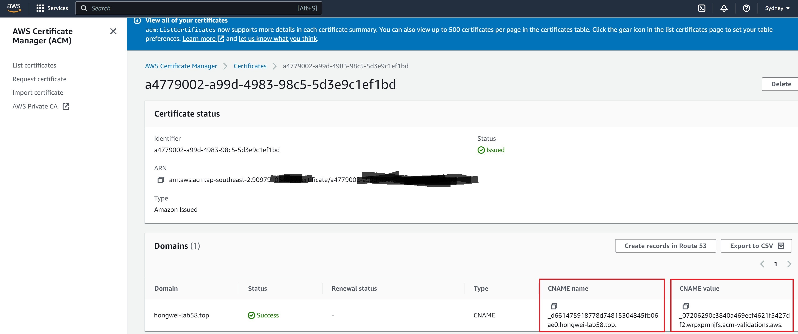

# server-configurations

## EC2 guide
### An important step might be missing

本文对应从阿里云万网购买域名。

使用AWS的EC2实例，并且通过AWS申请免费证书。

1. 先从AWS证书这设置页中复制以下内容，用于稍后填写到阿里云的域名解析CNAME记录中。


2. 按照以下图示，添加CNAME的记录，主机记录对应上图的CNAME name, 记录值对应上图中的CNAME value。

3. 此外，还需添加默认的两个记录@和www。


如下：

云解析DNS/域名解析/解析设置
| 主机记录 | 记录类型 | 解析请求来源(isp) | 记录值 | TTL | 状态 | 备注 | 操作 |
|---|---|---|---|---|---|---|---|
| www | A | 境外 | 54.206.109.xxx | 10 分钟 | 正常 | | (略) |
| @ | A | 境外 | 54.206.109.xxx | 10 分钟 | 正常 | | (略) |
| _d661475918778d74815304845fb06xxx | CNAME | 境外 | _07206290c3840a469ecf4621f5427xxx.wrpxpmnjfs.acm-validations.aws | 10 分钟 | 正常 | | (略) |

4. 如何使用Nginx+Https+万网域名+AWS ACM公有证书

参考视频：[How to Setup SSL certificate into your AWS EC2 instance 2021 (Nginx + PHP 8 + Amazon Linux 2) by 
AWS With Atiq](https://www.youtube.com/watch?v=_3t-DZEPSIg)

- 添加和关联Elastic IPs, 即使已经有AWS自动提供的Public IP，也可以单独绑定一个Elastic IP.

- 在AWS的Hosted Zone中添加类似的路由信息，并且额外添加NS和SOA记录，如下图。


- 在Nginx配置文件中只配置监听80端口，即不配置Https相关的安全信息。

- 通过Yum安装certbot, certbot-nginx然后生成证书：

```
> sodu yum install epel-release

> sodu yum install certbot python2-certbot-nginx

> sodu certbot --nginx
```

- 输入Email等信息，然后在选择域名数字时，可以输入：

```
> 1,2
```

来同时选择hongwei-lab58.top和www.hongwei-lab58.top.

此时，浏览器输入:

https://hongwei-lab58.top 

即可成功访问https域名了。

